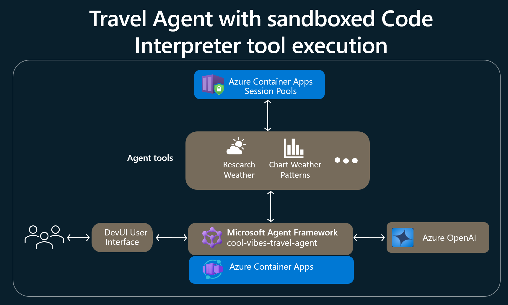

# Cool Vibes Travel Agent 🌴

A travel planning agent built with [Microsoft Agent Framework](https://github.com/microsoft/agent-framework) and Azure OpenAI. What makes it interesting is **how tools run code safely** — the agent sends LLM-generated Python to an [Azure Container Apps Dynamic Session Pool](https://learn.microsoft.com/azure/container-apps/sessions), a sandboxed code interpreter that executes untrusted code in an isolated container, completely separate from the agent process.

## Why Session Pools matter

When an AI agent needs to run code — fetch live weather data, generate charts, do math — you have two options: run it in your process (risky) or run it in a sandbox (safe). This project demonstrates both side by side. The ACA Dynamic Session agent sends LLM-generated code to a managed sandbox with network egress, file I/O, and pre-installed packages — but zero access to your host.

The key moment happens here, in [chart_sandbox_aca.py](tools/chart_sandbox_aca.py):

```python
exec_result = execute_in_sandbox(
    code=sandbox_code,
    session_id=session_id,
    pool_management_endpoint=pool_management_endpoint,
    auth_header=auth_header,
    timeout=60,
)
```

The agent asks Azure OpenAI to generate matplotlib charting code, then ships it to a Session Pool for execution. The sandbox runs the code, saves a PNG, and the agent downloads it back. If anything fails, it falls back to local execution gracefully.

## Architecture



| Component | Purpose |
|---|---|
| **Microsoft Agent Framework** | Agent runtime with middleware, telemetry, and DevUI |
| **Azure OpenAI (GPT-4o)** | LLM for conversation and code generation |
| **ACA Session Pools** | Sandboxed Python code interpreter (PythonLTS, Dynamic) |
| **Azure Container Apps** | Hosts the agent as a container |
| **Application Insights** | Observability — `invoke_agent`, `chat`, `execute_tool` spans |

## Usage

The agent ships with two variants you can switch between in the DevUI dropdown:

- **Tools run in ACA Dynamic Session** *(default)* — tools execute in a secure sandbox
- **Tools run along main Agent** — tools execute locally in the agent process

### Example conversation

**Prompt 1** — Say hello and let it learn your preferences:
> Hey

The agent greets you and asks what kind of trip you're looking for.

**Prompt 2** — Ask for weather-based travel advice:
> I'm contemplating between Miami and Tokyo in May depending on weather.

The agent calls the `research_weather` tool to fetch 14-day forecasts for both cities, then presents a side-by-side comparison with temperatures, precipitation, and rainy days. It suggests creating a visual chart.

**Prompt 3** — Request the chart:
> yes, please plot the chart

The agent generates matplotlib code via Azure OpenAI, executes it in the ACA Session Pool sandbox, downloads the resulting PNG, and displays a dark-themed dual-subplot chart comparing temperature trends and precipitation bars for both cities.

## Setup

### Prerequisites

- Python 3.11+
- [Azure Developer CLI (azd)](https://learn.microsoft.com/azure/developer/azure-developer-cli/install-azd)
- An Azure subscription
- An Azure OpenAI resource with a GPT-4o deployment

### Run locally

1. **Clone and install dependencies**

```powershell
git clone <repo-url>
cd AF.AMR.VibeCoded
python -m venv .venv
.venv\Scripts\activate
pip install --pre -r requirements.txt
```

2. **Configure environment**

Copy `.env.example` to `.env` and fill in your values:

```dotenv
# Azure OpenAI (required)
AZURE_OPENAI_ENDPOINT=https://your-instance.openai.azure.com/
AZURE_OPENAI_API_KEY=your_api_key
AZURE_OPENAI_API_VERSION=preview
AZURE_OPENAI_DEPLOYMENT_NAME=gpt-4o

# ACA Session Pool (required for sandbox agent, optional for local agent)
ACA_POOL_MANAGEMENT_ENDPOINT=https://your-region.dynamicsessions.io/subscriptions/.../sessionPools/your-pool

# Application Insights (optional)
APPLICATIONINSIGHTS_CONNECTION_STRING=InstrumentationKey=...
```

3. **Run the application**

```powershell
python main.py
```

4. **Open DevUI** at `http://localhost:80`, select an agent from the dropdown, and start chatting.

### Deploy to Azure

The project includes full infrastructure-as-code via Bicep. A single command provisions everything — Azure OpenAI, Container Apps, Session Pool with egress enabled, Container Registry, Application Insights, and managed identity with the correct role assignments.

```powershell
azd auth login
azd init
azd up
```

This will:
- Build the Docker image
- Create a resource group with all Azure resources
- Push the image to Azure Container Registry
- Deploy to Azure Container Apps
- Configure the Session Pool with `EgressEnabled` network access
- Wire up all environment variables and managed identity credentials

### Project structure

```
├── main.py                           # Entry point — creates agents, starts DevUI
├── agents/
│   └── travel_agent.py               # Agent name, description, and system instructions
├── tools/
│   ├── aca_auth.py                   # ACA Session Pool auth and execution helpers
│   ├── chart_sandbox_aca.py          # LLM-generated chart code → ACA sandbox
│   ├── chart_sandbox_local.py        # Local chart generation fallback
│   ├── chart_server.py               # Chart URL helpers (served by main app)
│   ├── weather_sandbox_aca.py        # Weather research in ACA sandbox
│   ├── weather_sandbox_local.py      # Local weather research (Open-Meteo API)
│   └── travel_tools.py               # Tool factory — routes to local or ACA
├── infra/
│   ├── main.bicep                    # Orchestrator — all Azure resources
│   ├── main.parameters.json
│   └── core/                         # Bicep modules (host, ai, security, monitor)
├── azure.yaml                        # azd project definition
├── Dockerfile                        # Python 3.11 container
└── requirements.txt
```

## Documentation

- [Microsoft Agent Framework](https://github.com/microsoft/agent-framework)
- [Azure Container Apps Dynamic Sessions](https://learn.microsoft.com/azure/container-apps/sessions)
- [Azure Container Apps Session Pools — Code Interpreter](https://learn.microsoft.com/azure/container-apps/sessions-code-interpreter)
- [Azure Developer CLI (azd)](https://learn.microsoft.com/azure/developer/azure-developer-cli/)
- [Azure OpenAI Service](https://learn.microsoft.com/azure/ai-services/openai/)

## License

MIT License — Sample/Demo Application
